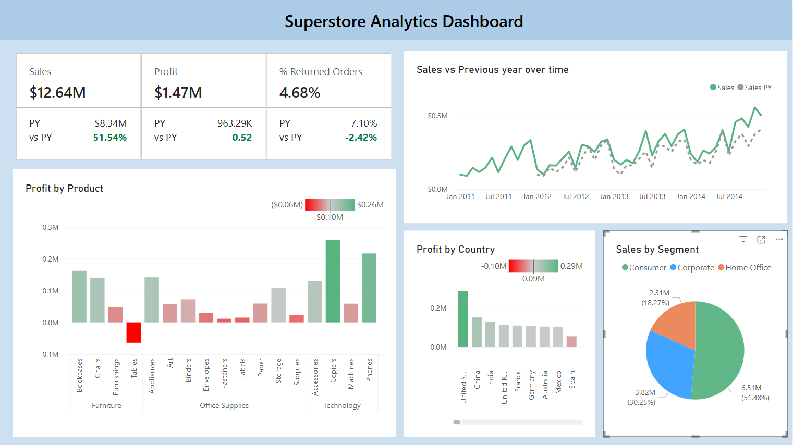
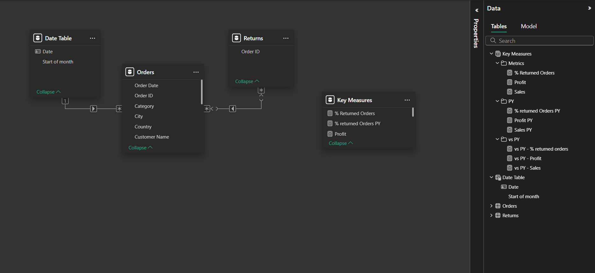

## 📘 Data_Visualization - Superstore Analytics Dashboard 

---

## 📁 Project Description:
This Power BI dashboard provides a comprehensive business intelligence report on global superstore sales performance. It includes interactive visualizations and key metrics such as:
- Total Sales & Profit
- Percentage of Returned Orders
- Year-over-Year Growth Analysis
- Profitability by Product and Country
- Segment-wise Sales Distribution

---

## 📊 Dashboard Features:
1. **KPI Tiles**:
   - Total Sales, Total Profit, % Returned Orders
   - Prior Year Comparison

2. **Line Chart**:
   - Sales vs Previous Year over Time (Trend Analysis)

3. **Bar Chart**:
   - Profit by Product (highlighting loss-making items)

4. **Map/Column Chart**:
   - Profit by Country

5. **Pie Chart**:
   - Sales Distribution by Segment (Consumer, Corporate, Home Office)

---

## 🔁 Data Model:
- **Orders Table**: Contains core sales data (Product, Region, Sales, Profit, etc.)
- **Returns Table**: Lists returned `Order ID`s to calculate return rates
- **Date Table**: Enables time intelligence functions like year-over-year comparisons
- **Relationships**:
  - `Orders[Order ID]` → `Returns[Order ID]`
  - `Orders[Order Date]` → `Date Table[Date]`

---

## 📐 Key DAX Measures:
- `Sales`
- `Profit`
- `% Returned Orders`
- `Sales PY` (Previous Year)
- `vs PY - % Returned Orders`
- `vs PY - Profit`
- `vs PY - Sales`

---

## 📂 Dataset Used:
- **Source**: Global Superstore Dataset  
- **Files**:
  - `Orders.csv`
  - `Returns.csv`
  - `People.csv` (optional for analysis)
- Cleaned and formatted for use in Power BI

---

## 🛠 Tools & Technologies:
- **Power BI Desktop**
- **DAX (Data Analysis Expressions)**
- **CSV Data Files**

---

## 📈 Insights from the Dashboard:
- 51.54% increase in sales compared to the previous year
- Tables category is unprofitable and may need strategic pricing adjustment
- Returned orders make up 4.68% of total orders, down 2.42% from the previous year
- U.S. and Technology category lead in profitability
- Consumer segment accounts for the largest share of revenue

---

## 📸 Screenshots

---

## 🧾License:
This project is licensed under the MIT License
